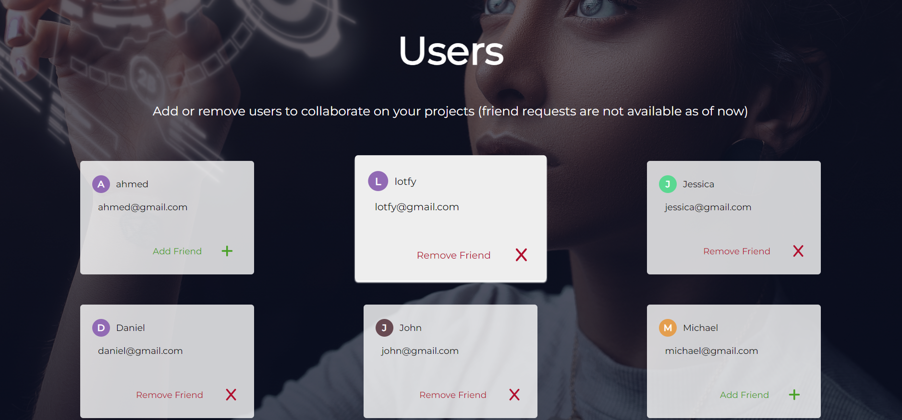
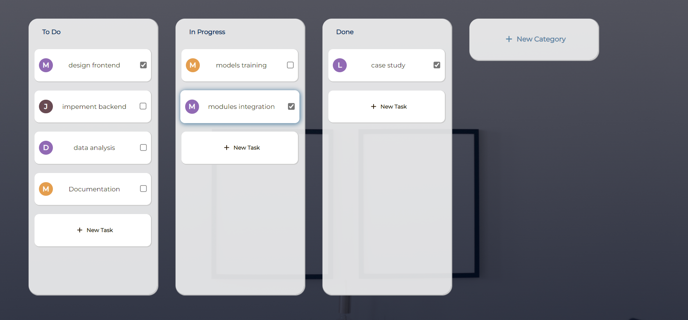

# ProjeX-Web-App

A simple project management system built with React for the front-end and a .Net core web API for the backend.

## Table of Contents

1. [About Project](#about-project)
2. [Screenshots](#screenshots)
3. [Setup And Initialization](#setup-and-initialization)
4. [Notes And Missing Features](#notes-and-missing-features)
5. [Copyrights And Acknowledgements](#copyrights-and-acknowledgements)

## About Project

ProjeX-Web-App is designed to help users manage tasks efficiently. It allows teams to communicate effectively by creating project boards, with each board having multiple task categories for tracking progress.

## Screenshots

### Home Page


### Users Page



### Boards Page



## Setup And Initialization

### API Configuration

1. **Configure the API:**

   - Open MS SQL Server and create a database named "ProjeX".
   - Navigate to `/ProjeX-API/ProjeX-API` and create a `.env` file.
   - Inside the `.env` file, add this entry:
     ```plaintext
     TOKEN_SECRET_KEY=cc7e0d44fd473002f1c42167459001140ec6389b7353f8088f4d9a95f2f596f2
     ```
     (This secret is used to hash the tokens by the API; you can use any token secret, just ensure it's the same across the frontend and backend).
   - Navigate to `appsettings.json` and change the server name in the default connection object to your SQL Server name.
   - Open NuGet Package Manager and run the migrations on the database using:
     ```bash
     dotnet ef database update
     ```
   - Run the API server.

2. **Configure the frontend:**

   - Open the `ProjeX-React` folder in VS Code.
   - Install all required packages by running:
     ```bash
     npm i
     ```
   - Create a `.env` file in the root directory of `ProjeX-React` and add the following entries:
     ```plaintext
     VITE_API_URL=https://localhost:7114
     VITE_TOKEN_SECRET_KEY=cc7e0d44fd473002f1c42167459001140ec6389b7353f8088f4d9a95f2f596f2
     ```
   - Run the React server using:
     ```bash
     npm run dev
     ```

3. **Running the Project:**

   - Run the API using Visual Studio.
   - Run the React app using the command:
     ```bash
     npm run dev
     ```
   - Enjoy :D the project should be working now.

## Notes And Missing Features

This project is currently incomplete and is missing the following features:

- Edit and delete options are not available yet for some entities like task cards, user accounts, etc.
- Task cards should be movable between categories using the mouse, but this feature is not yet implemented.
- Sessions currently rely on tokens saved in local storage, which is not the most secure and is vulnerable to XSS attacks. Using HttpOnly cookies would be a more secure approach.

## Copyrights And Acknowledgements

This project is solely done by the author Mena Ashraf.

- **About The Author**
  - Name: Mena Ashraf Mikhael Saleh
  - Email: [Mena.a.saleh.2001@gmail.com](mailto:Mena.a.saleh.2001@gmail.com)
  - GitHub: [Mena-Ibrahim](https://github.com/Mena-Ibrahim)
  - LinkedIn: [Mena Saleh](https://www.linkedin.com/in/mena-saleh-23b947167/)
